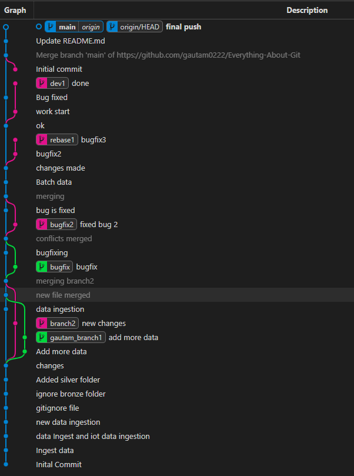
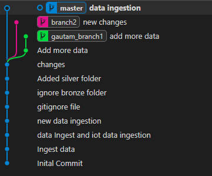

# 🚀 Everything About Git & GitHub

A hands-on repository documenting my journey of learning **Git and GitHub** through practical examples, branching strategies, merge conflicts, rebasing, cherry-picking, reflog recovery, and remote repository management.

---

## 📌 Overview

This repository contains practical demonstrations of:

- Git Initialization
- Staging and Committing Changes
- Branch Creation and Management
- Merging Branches
- Merge Conflict Resolution
- Git Rebase
- Cherry Pick
- Git Reset
- Git Reflog
- Working with Remote Repositories
- GitHub Integration
- Branching Strategies

The objective of this repository is to gain practical experience with Git concepts that are commonly used in real-world software development.

---

# 🏗️ Repository Journey

## 1️⃣ Repository Initialization

Started by creating a Git repository and performing basic commits.

```bash
git init
git add .
git commit -m "Initial Commit"
```

### Commit History

```text
Initial Commit
Ingest Data
Data Ingest and IoT Data Ingestion
New Data Ingestion
```

---

## 2️⃣ Working with .gitignore

Learned how Git tracks files and how to exclude unwanted files and folders.

### Example

```gitignore
bronze/
*.log
__pycache__/
```

### Commits

```text
gitignore file
ignore bronze folder
```

---

## 3️⃣ Branching

Created multiple branches to simulate parallel development workflows.

### Branches Created

```text
main
gautam_branch1
branch2
bugfix
bugfix2
rebase1
dev1
feature1
```

### Commands Used

```bash
git branch branch_name
git switch branch_name
git checkout branch_name
```

---

## 4️⃣ Feature Development

Created feature branches and implemented independent changes.

### Example

#### Branch: gautam_branch1

```text
Add more data
add more data
```

#### Branch: branch2

```text
new changes
```

---

## 5️⃣ Merging Branches

Merged feature branches back into the main branch.

### Commands

```bash
git merge gautam_branch1
git merge branch2
```

### Merge Commits

```text
new file merged
merging branch2
```

### Learning Outcome

- Fast-forward merges
- Three-way merges
- Merge commits

---

## 6️⃣ Merge Conflict Resolution

One of the most important Git concepts.

Created conflicting changes in different branches and attempted to merge them.

### Example

```bash
git merge bugfix2
```

Git reported:

```text
CONFLICT (content)
Automatic merge failed
```

Resolved conflicts manually and completed the merge.

### Learning Outcome

✅ Understanding merge conflicts

✅ Conflict markers

✅ Manual conflict resolution

✅ Completing merge commits

---

## 7️⃣ Bug Fix Workflow

Created dedicated bug-fix branches.

### Branches

```text
bugfix
bugfix2
```

### Commits

```text
bugfix
bugfixing
bug is fixed
fixed bug 2
```

### Commands

```bash
git switch -c bugfix
git commit -m "bugfix"
git merge bugfix
```

### Learning Outcome

- Isolated bug fixes
- Safe code integration
- Branch-based development

---

## 8️⃣ Git Rebase

Learned how to maintain a cleaner project history.

### Branch

```text
rebase1
```

### Commands

```bash
git rebase main
```

### Commits

```text
Batch data
changes made
bugfix2
bugfix3
```

### Learning Outcome

- Linear commit history
- Difference between Merge and Rebase
- Rewriting commit history

---

## 9️⃣ Cherry Pick

Learned how to copy specific commits from one branch to another.

### Command

```bash
git cherry-pick <commit_hash>
```

### Commit

```text
ok
```

### Learning Outcome

- Selecting individual commits
- Avoiding unnecessary merges
- Targeted code movement

---

## 🔟 Git Reset

Experimented with different reset operations.

### Commands

```bash
git reset HEAD
git reset HEAD~1
git reset <commit_hash>
```

### Learning Outcome

- Soft Reset
- Mixed Reset
- Hard Reset
- Undoing commits safely

---

## 1️⃣1️⃣ Git Reflog

Explored Git's hidden safety net.

### Command

```bash
git reflog
```

### Activities Tracked

- Commits
- Checkouts
- Branch Switching
- Rebases
- Resets
- Cherry Picks

### Why Reflog Matters

Even if commits appear lost, Git Reflog can help recover them.

---

## 1️⃣2️⃣ Working with GitHub

Connected local repositories to GitHub.

### Commands

```bash
git remote add origin <repository_url>
git push -u origin main
git pull origin main
git fetch
```

### Learning Outcome

- Remote repositories
- Push and Pull operations
- Upstream tracking
- Synchronizing local and remote branches

---

# 📸 Repository Visualizations

## Git Graph



---

## Branch History


---

## Git Reflog Activity



---

# 🛠️ Git Commands Practiced

## Repository Management

```bash
git init
git clone
git status
git log
```

## Staging & Commits

```bash
git add .
git commit -m "message"
```

## Branching

```bash
git branch
git switch
git checkout
```

## Merging

```bash
git merge
```

## Rebasing

```bash
git rebase
```

## Cherry Picking

```bash
git cherry-pick
```

## Recovery

```bash
git reset
git reflog
```

## Remote Repositories

```bash
git remote
git push
git pull
git fetch
```

---

# 📚 Key Learnings

✅ Git Fundamentals

✅ Repository Management

✅ Staging Area

✅ Commits

✅ Branching

✅ Merging

✅ Merge Conflicts

✅ Rebase

✅ Cherry Pick

✅ Reset

✅ Reflog

✅ Remote Repositories

✅ GitHub Workflow

---

# 🎯 Conclusion

This repository serves as a complete practical guide to learning Git and GitHub through hands-on implementation.

By working with commits, branches, merges, rebases, cherry-picks, resets, reflog, and GitHub integration, I developed a strong understanding of modern version control workflows used in professional software development.

---

## 👨‍💻 Author

**Gautam Sukhani**

Learning Git one commit at a time 🚀